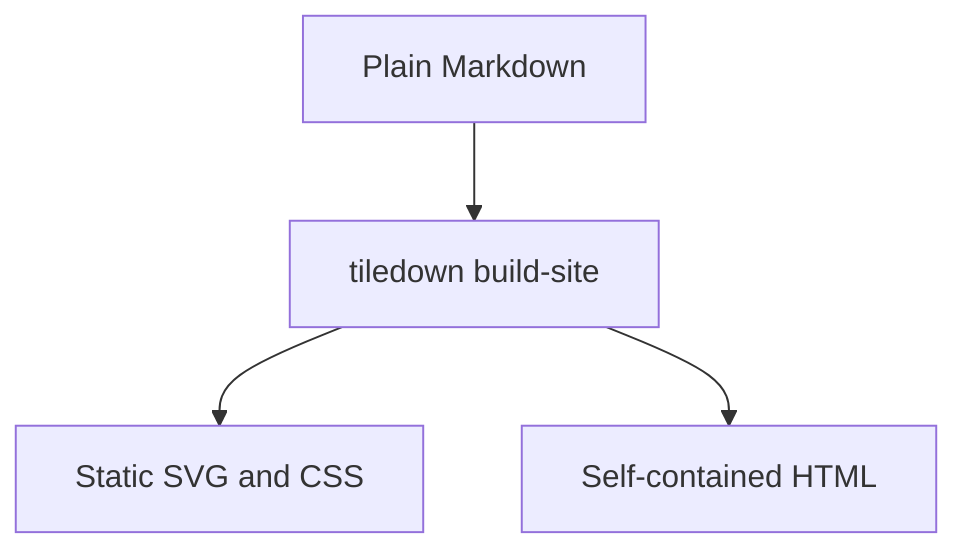
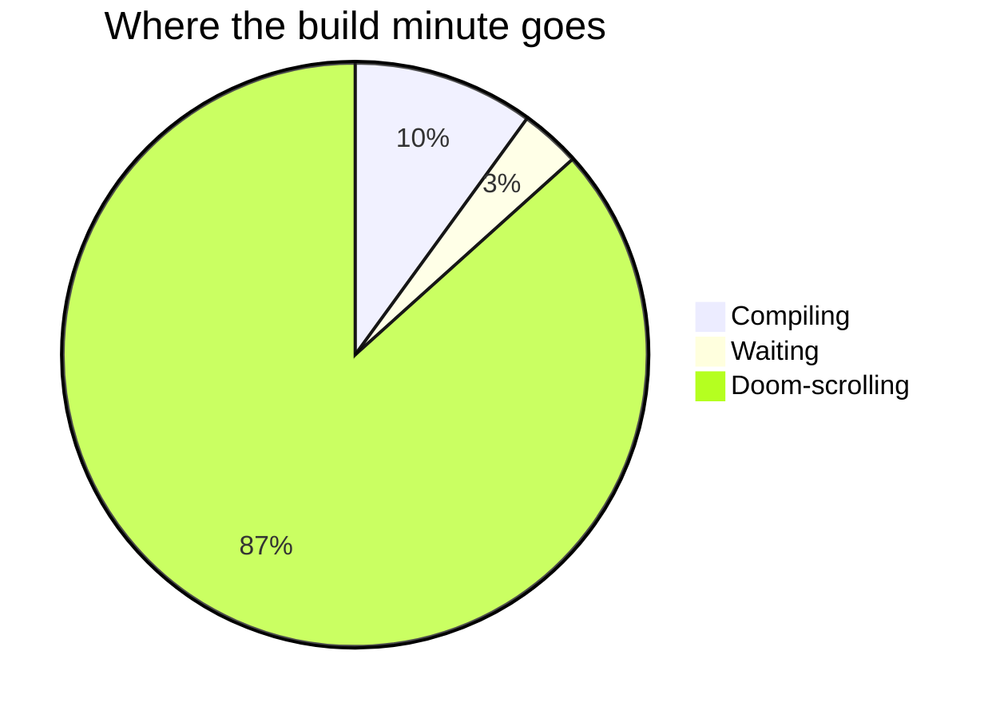

# Feature Tour

Everything below is rendered by the build from ordinary Markdown. The static
surfaces — math, charts, the pie, source-code color — ship as SVG and CSS with
**no client-side JavaScript and no web fonts**. This page is the demo: view
source and you will find finished output, not a runtime.

## Math, typeset at build time

Write TeX in a `$$…$$` block and TileDown typesets it to a self-contained SVG —
real glyph outlines from Latin Modern Math, parsed in pure Swift. No MathJax, no
LaTeX install, no `dvisvgm`. The same engine typesets to PDF.

$$e^{i\pi} + 1 = 0$$

$$\frac{-b \pm \sqrt{b^2 - 4ac}}{2a}$$

More in [Math in Markdown](post:math-in-markdown).

## Charts as static SVG

A fenced `chart` block becomes a static SVG at build time — zero shipped
JavaScript, identical in every browser. (The numbers are invented; the rendering
is real.)

```chart
type: bar
title: Developer happiness by static site generator
categories: TileDown, Hugo, Jekyll, Bespoke PHP
y-label: happy devs (%)
series: This year = 92, 71, 64, 12
```

When a chart needs richer hover, there is an opt-in interactive version. See
[Charts in Markdown](post:charts-in-markdown) and
[Interactive Charts](post:interactive-charts).

## Diagrams

A `mermaid` flowchart renders through the themed mermaid runtime, while a `pie`
renders as a static SVG with no runtime at all:





More in [Diagrams in Markdown](post:diagrams-in-markdown).

## Source code, colored at build time

Fenced code is highlighted by a Swift tokenizer at build time, so the page ships
colored spans and shared CSS instead of a browser highlighter. Eighteen
languages are supported, Swift, Shell, Python, Rust, Go, and TypeScript among
them:

```swift
struct TileDownFeature {
    let name = "static syntax highlighting"
    let shipsJavaScript = false
}
```

```sh
tiledown build-site content/ dist/
tiledown json content/index.md .build/home.json
```

See [Static Code Color](post:tiledown-0-4-1-static-code-color).

## Per-article PDF

Every post on this site ships a **Download PDF** link. That PDF is typeset at
build time from the same Markdown source as the HTML page — by the pure-Swift
MarkdownPDF engine, which shares its math typesetting with the formulas above.
No headless browser, no print pipeline, no server: the build writes a real,
valid `%PDF` document, math and all, and serves a few kilobytes of static file.

Because the engine is just Swift, it also compiles to WebAssembly, so the same
parser and PDF writer can run live in your browser. See
[The PDF engine, in your browser](post:pdf-in-the-browser).

## Markdown stays the canonical source

TileDown parses CommonMark through Swift Markdown. Raw HTML is escaped by design,
so the source stays portable and editor-friendly.

> The Markdown file remains the canonical source. The engine derives the rendered
> HTML, shared CSS, browser JavaScript, JSON, and feeds from that one file.

Typed references resolve at build time from `tiledown.yml` and the content tree:

| Reference | Resolves to |
|:---|:---|
| `page:` | [](page:docs) |
| `post:` | [](post:browser-visible-tiles) |
| `tag:` | [](tag:Tiles) |
| `social:` | [GitHub](social:github) |
| `link:` | [Design notes](link:design), through an `/out/` redirect |


## Tiles: behavior on a static page

Tiles are typed content blocks. Some are pure static output, some add scoped
local interactivity, and the next class will reach a backend through a safe
contract.

The **callout** tile is static — themed HTML and CSS, no runtime:

:::tile callout
title: Static tile
body: A callout emits typed properties as themed HTML, with no browser runtime.
:::

The **counter** tile is local — it ships a little JavaScript but needs no server:

:::tile counter
label: Press to test JavaScript
:::

The **embed** tile is static and provider-constrained — you keep a safe URL in
Markdown and TileDown emits one responsive, sandboxed iframe with no script of
its own, rewriting YouTube links to the privacy-preserving no-cookie domain:

:::tile embed
url: https://www.youtube.com/watch?v=jNQXAC9IVRw
title: The first video ever uploaded to YouTube, for scale
aspectRatio: 16/9
:::

**Next: dynamic tiles backed by a service.** The engine already renders typed
`service-form` tiles that bind to a service contract and keep credentials off the
client — think a newsletter signup posting to Mailgun, or a Discord webhook —
through a server-side proxy route. The remaining work is loading those bindings
from `tiledown.yml`, so this page does not fake a live one. See
[Service Contracts Are Next](post:service-contracts).

## What else the build does

- **Theme-aware images** — pair `image` with `imageDark` in front matter; layouts switch hero and card art with the page theme.
- **RSS** — a feed is generated from the dated posts.
- **Tag AND filtering** — generated tag pages are static URLs; start at [Markdown](/tags/markdown/) and narrow to [Markdown AND Swift](/tags/markdown/swift/).
- **Outbound redirect shims** — configured links route through `/out/` pages.
- **Drafts excluded** — `draft: true` pages stay out of the published output.
