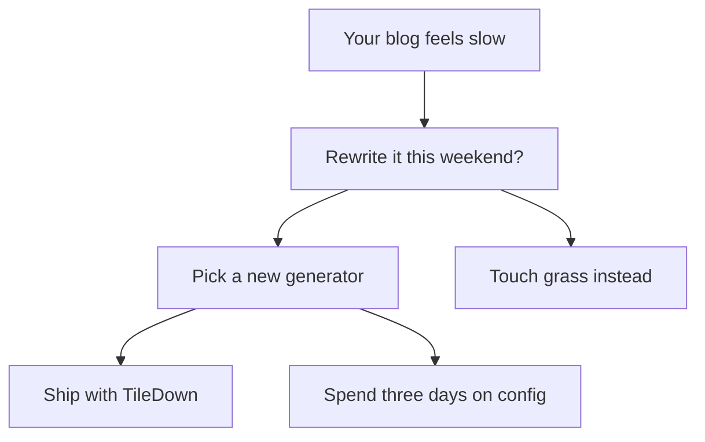
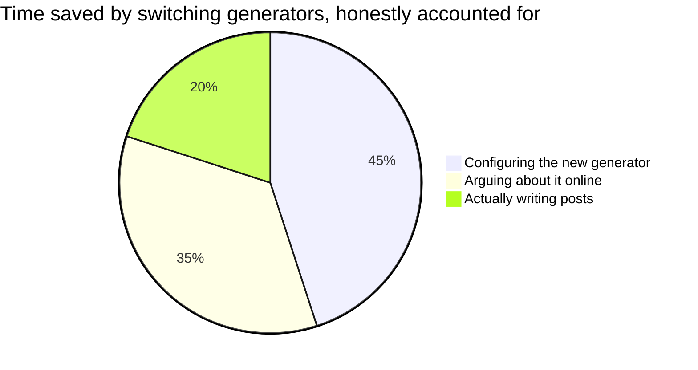

# Diagrams in Markdown

Diagrams are content, not tiles. A fenced block tagged `mermaid` renders through
the same client-side mermaid runtime the diagram tile uses, themed to match the
page. A `pie` block is special: TileDown renders it as a static SVG chart with no
runtime at all, exactly the way the sibling MarkdownPDF project does.

Here is the industry-standard decision process for choosing a generator:

According to a survey we did not conduct, **90% of developers** are happier after
that diagram than before it. These numbers are entirely made up. We fabricated
them for the demo. The arrows, however, point exactly where we told them to.

And here is how the time a generator saves you is actually spent, rendered as a
static pie (no JavaScript shipped):

Same fence, two outcomes: the flowchart is a live diagram, the pie is a static
chart. Both are plain Markdown, both re-theme with the page, and the pie ships
zero bytes of script. The percentages remain proudly invented.
